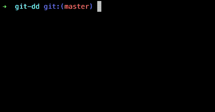

# git-dd

> git command to delete branches interactively

## How to use
Install git-dd with gem:
```
gem install git-dd
```

Run `git dd` in a git repository. Use arrow keys, press Space to select and Enter to finish:


Press `Ctrl + c` to return.